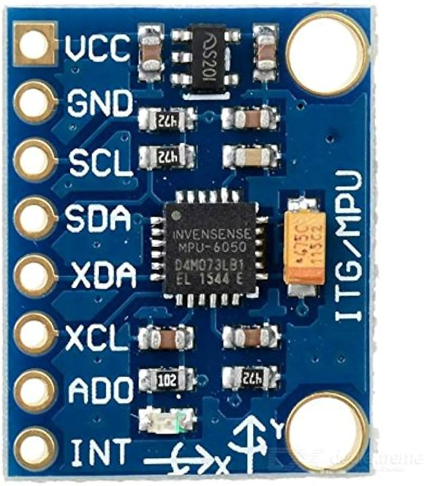

<p align="center">
    
</p>
**ESP8266ServerFoundation MPU6050.  Browser & Smart Phone accessible Electronic Level.**

- **Free**: open source software.  BE THE SAME.
- **Dynamic**: Change the default interface, configure the WiFi using SPIFFS filesystem.
- **Webserver**: REST API.  Access Point Captive Portal.  Serve custom .cs, .js, .html.
- **Websocket Server**: data feed provider.
- **Rudimentary**: An intented End of Life project.  A basic building block for something more.

-----

## Requirements

- **Arduino IDE**: https://www.arduino.cc/en/software
- **ESP8266 Development Board**: <link to store>
- **MPU6050 Sensor Board**: <link to store>
- **Prototype Board**: <link to store>
- **Prototype Breadboard Wiring**: <link to store>


## Assembly

<p align="center">
    &nbsp;
</p>

**Connect Pins**:
| **MPU6050** | **ESP8266** |
| ----------- | ----------- |
| VCC         | 3.3V        |
| GND         | GND         |
| SCL         | SCL         |
| SDA         | SDA         |


## Uploading code to the ESP8266 Development Board

1.  Open the **Adruino IDE**
2.  Open the ESP8266ServerFoundation sketch.
3.  Select the appropriate board and com port from the Tools menu of the Arduino IDE.
4.  Select Sketch -> Upload in the Arduino IDE.


## Initial accessing the ESP8266ServerFoundation device

- **Serial Monitor**: Access from Arduino IDE.
  - Accepts 1 Serial input command: `restart`
- **WiFi Access Point**: Default ssid = `ESP[device_mac_address]`
  - **Captive Portal**.  Open a web browser and go to any web address.  All redirect to device interface.


## Web API & example applications

Essentially open the web interface and review the source code of each page for examples.

- **Delete SPIFFS File**: `/api/deletespiffsfile?file==[filename]`
- **Edit SPIFFS File**: `/applications/editspiffsfile`
- **Format SPIFFS**:  `/api/formatspiffs'`
- **Get Data**:  `/api/getdata`
- **List SPIFFS**:  `/api/listspiffs`
- **Read EEPROM**:  `/api/readeeprom`
- **Read SPIFFS File**:  `/api/readspiffsfile?file=[filename]`
- **Restart Device**:  `/api/restartesp`
- **Scan Networks**:  `/api/scannetworks`
- **Websocket**:  `/applications/websocket`

## Configuring WiFi Station and Access Point

- **Edit SPIFFS File**: `/applications/editspiffsfile`
  - **filename**: `/wifi.cfg`
  ```
  {
   "enableStation":true,
   "WiFiConnection":
    [
     {
      "ssid":"ConnectToNetwork",
      "password":"Password",
      "connect":true,
      "hostname":""
     }
    ],
	 "enableAP":true,
     "softAP":
	  {
	   "ssid":"",
	   "psk":"",
	   "channel":1,
	   "hidden":true,
	   "max_connection":4
	  }
  }
  ```

## MPU6050 Websocket Data Interface

<p align="center">
    
</p>
